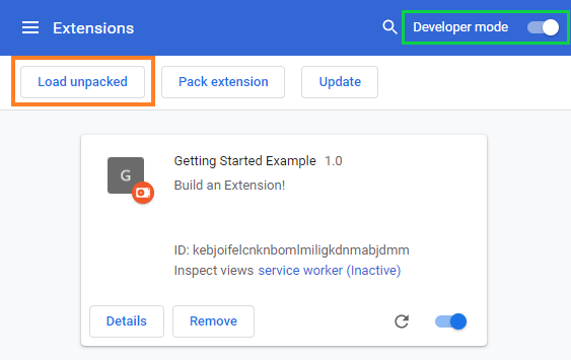

# Hide Live Chat Replay In Youtube

Click `Hide chat replay` button automatically

# Usage

-   Download the repo
-   Open the Extension Management page by navigating to [chrome://extensions](chrome://extensions).
    -   Alternatively, open this page by clicking on the Extensions menu button and selecting Manage Extensions at the
        bottom of the menu.
    -   Alternatively, open this page by clicking on the Chrome menu, hovering over More Tools then selecting Extensions
-   Enable Developer Mode by clicking the toggle switch next to Developer mode.
-   Click the Load unpacked button and select the extension directory.

